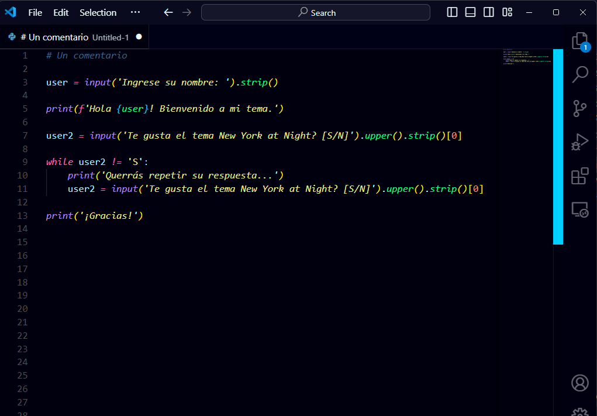

<h1>New York At Night</h1>

## Descripción

"New York At Night" es un tema para Visual Studio Code inspirado en las luces vibrantes y la energía nocturna de la ciudad que nunca duerme. Este tema ofrece una estética moderna, ideal para programar en ambientes oscuros.

## Instalación

1. Abre Visual Studio Code.
2. Ve a la sección de Extensiones (`Ctrl+Shift+X`).
3. Busca `New York At Night` y haz clic en `Instalar`.
4. Selecciona el tema desde el menú de temas.

## Capturas de Pantalla

## Contribuir
¡Tu feedback y contribuciones son bienvenidos! Si encuentras algún problema o tienes sugerencias, por favor abre un <a href="https://github.com/GGabi40/new-york-at-night/issues?formCode=MG0AV3">issue</a> en el repositorio.

## Créditos
Desarrollado por <a href="instagram.com/@ggabi40">GGabi40</a>.