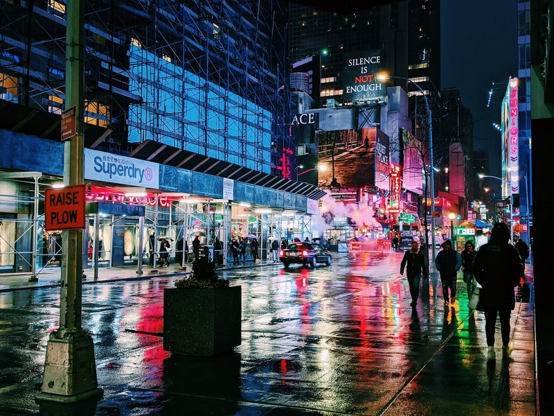
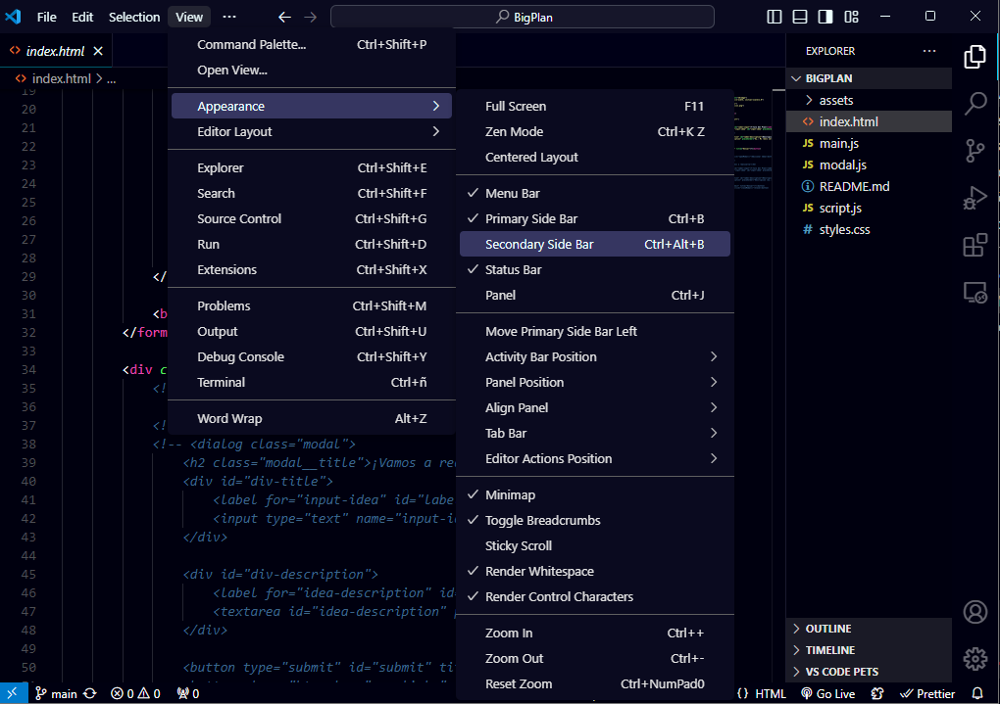
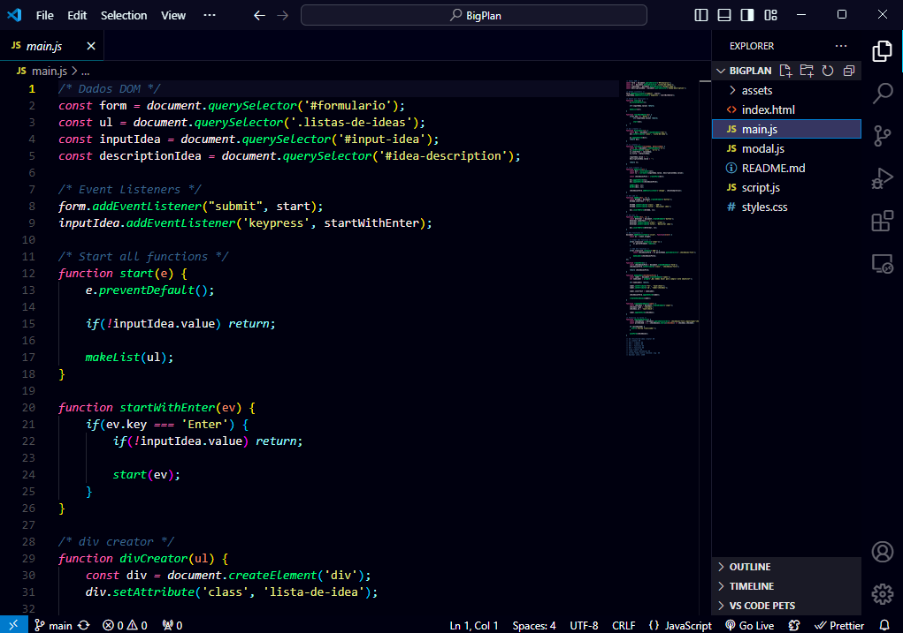

<h1>New York At Night Theme</h1>

## Descripción

"New York At Night" es un tema para Visual Studio Code inspirado en las luces vibrantes y la energía nocturna de la ciudad que nunca duerme. Este tema ofrece una estética moderna, ideal para programar en ambientes oscuros.

## Instalación

1. Abre Visual Studio Code.
2. Ve a la sección de Extensiones (`Ctrl+Shift+X`).
3. Busca `New York At Night` y haz clic en `Instalar`.
4. Selecciona el tema desde el menú de temas.

## Capturas de Pantalla

## Contribuir
¡Tu feedback y contribuciones son bienvenidos! Si encuentras algún problema o tienes sugerencias, por favor abre un <a href="https://github.com/GGabi40/new-york-at-night/issues?formCode=MG0AV3">issue</a> en el repositorio.

## Paleta de Colores

| Color                | Hex         | RGB            | HSL            |  |
|----------------------|-------------|----------------|----------------|--|
| Negro Profundo       | `#00000f`   | 0 0 15         | 240° 100% 7%   |  |
| Blanco Pálido        | `#eeffff`   | 238 255 255    | 180° 100% 97%  |  |
| Gris Claro           | `#e3e3e3`   | 227 227 227    | 0° 0% 89%      |  |
| Amarillo Brillante   | `#ffee00`   | 255 238 0      | 56° 100% 50%   |  |
| Azul Nocturno        | `#1a1a2e`   | 26 26 46       | 240° 28% 14%   |  |
| Azul Profundo        | `#000011`   | 0 0 17         | 240° 100% 3%   |  |
| Azul Oscuro          | `#00000f`   | 0 0 15         | 240° 100% 7%   |  |
| Verde Menta | `#98ff98` | 152 255 152    | 120° 100% 80%  |   |
| Magenta  | `#e91e63`   | 233 30 99      | 340° 81% 52%   |  |
| Azul Cian | `#00bcd4`   | 0 188 212      | 187° 100% 42%  |  |
| Verde Menta Suave | `#00ffab` | 0 255 171 | 156° 100% 50% |  |

## Créditos

<table style="border: 2px solid #00d0ff;">
    <tr>
        <td style="padding: 10px;">
            
        </td>
    </tr>
    <tr>
        <td style="text-align: center; padding: 10px;">
            <strong>Gabriela Baptista</strong>
        </td>
    </tr>
</table>

Desarrollado por <a href="https://www.instagram.com/ggabi40">@GGabi40</a>.

### Colores Basados en
Los colores de este tema están inspirados en el <a href="https://github.com/getomni/omni">Omni Theme</a>. Gracias equipo <a href="https://github.com/rocketseat">Rocketseat</a>.